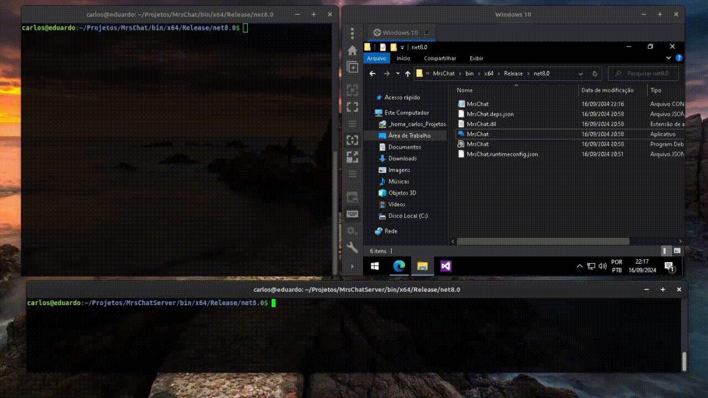

#  MrsChat

**MrsChat** é um aplicativo cliente que tem como objetivo se conectar a uma sala hospedada por um servidor MRS, pode ser adiquirido [neste meu outro repositório](https://github.com/FlaipyTheHost/MrsChatServer).

Criei este projeto inspirado em uma cena do filme **The Incredible Hulk (2008)** onde Bruce Banner se comunica com "Mr.Blue" de uma favela do Rio. Além da vontade de aprender como funciona a tecnologia cliente servidor na prática, com uso de sockets de rede.
# 

Captura do funcionamento de **MrsChat**:
# 

Para se executar é necessário ter um ambiente **.Net Core** em sua máquina.

**Windows:**

1. Apenas instale as dependências .Net Core que podem ser adiquiridas a partir [deste link](https://dotnet.microsoft.com/pt-br/download/dotnet/thank-you/runtime-8.0.8-windows-x64-installer).

2. Execute o arquivo MrsChatServer.exe que você pode transferir e extrair a partir das [releases](https://github.com/FlaipyTheHost/MrsChat/releases/).

**Ubuntu/Mint/Debian:**

1. Apenas instale o pacote `dotnet-runtime-8`.
  ```
sudo apt update
sudo apt install dotnet-runtime-8 -y
  ```
2. Extraia o arquivo zipado de [releases](https://github.com/FlaipyTheHost/MrsChat/releases/) usando o `unzip` ou outro software de sua escolha e execute o **MrsChat**.
 ```
unzip MrsChat_x64_Release_*.zip
dotnet MrsChat.dll <nome_usuário> <ip:porta>
 ```
ou caso prefira usar o arquivo `.conf`, pode apenas executar sem parâmetros.
```
dotnet MrsChat.dll
```
